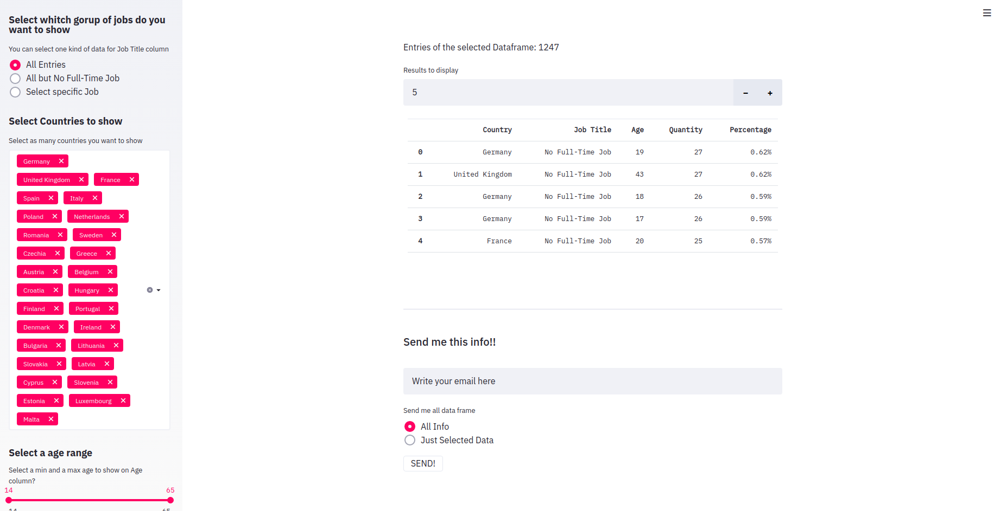
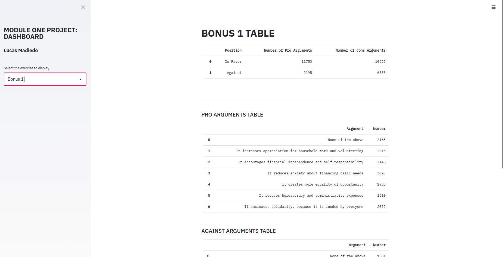
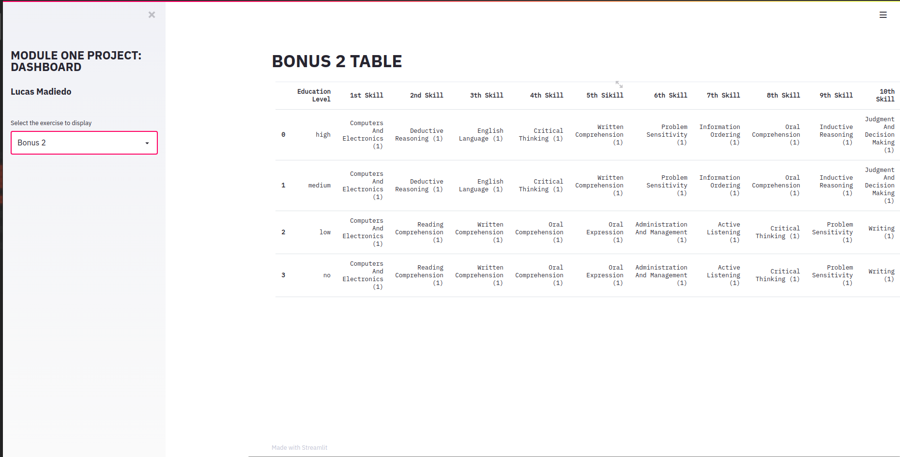

# **MODULE 1**      
## **FINAL PROYECT:** PIPELINES AND ANALYSIS ON A DATA PROJECT

**Lucas Madiedo**  
IronHack: Data Analysis Bootcamp

----
-----
## Overview
The purpose of this project was to clean and unificate data from differents sources by a pipeline process in order to obtain three different tables. 
Each of these tables uses these multiple source info to make aggregations and allows us to obtain conclusions based on a full informated point of view .

## Goals
Make a professional structured pipeline
Use argparse to give terminal line arguments to our script
Make a working combined dataframe
Extract the requested information
Display all the resulting info

## Dataset
 - SQL Data Base: [Here](http://www.potacho.com/files/ironhack/raw_data_project_m1.db) you can find the ```.db```  file 
 - API. We will use the API from the [Open Skills Project](http://dataatwork.org/data/).
 - Web Scraping. Finally, we will need to retrieve information about country codes from [Eurostat website](https://ec.europa.eu/eurostat/statistics-explained/index.php/Glossary:Country_codes).


## Technology stack
 ### Libraries Used
 - argparse  
 - os
 - sqlite3
 - pandas
 - requests
 - BeautifulSoup
 - Steamlit
 - pandas
 - Smtplib
 - EmailMessage
 - Configparser


### - Folder structure
```
── dashboard.py
├── data
│   ├── processed
│   │   ├── 01_FULL_raw_table.csv
│   │   ├── api_carrer_info_cleaned.csv
│   │   ├── arguments_against_cleaned.csv
│   │   ├── arguments_pro_cleaned.csv
│   │   ├── db_carrer_info_cleaned.csv
│   │   ├── db_countries_info_cleaned.csv
│   │   ├── db_personal_info_cleaned.csv
│   │   ├── db_poll_info_cleaned.csv
│   │   └── ws_countries_info_cleaned.csv
│   ├── raw
│   │   └── raw_data_project_m1.db
│   ├── results
│   │   ├── result_bonus1_procons_args.csv
│   │   ├── result_bonus2.csv
│   │   └── result_challenge1.csv
│   └── sent
│       └── mail_info.csv
├── main_script.py
├── notebooks
│   ├── bonus1.ipynb
│   ├── bonus2.ipynb
│   ├── dashboard bonus1.ipynb
│   ├── mail.ipynb
│   └── reporting.ipynb
├── p_acquisition
│   ├── __init__.py
│   ├── m_acquisition.py
├── p_analysis
├── p_reporting
│   ├── __init__.py
│   ├── m_reporting.py
├── p_wrangling
│   ├── __init__.py
│   ├── m_wrangling.py
├── README.md
├── requirements.txt
└── __trash__

```
## Process
### Step 1: Getting our data ready @ Data_Acquisition

Access and clean all tables in SQL Database and creates a df and a csv for each cleaned table  
Makes a df and csv file from webscraping process  
Makes a df and a csv from an API request of each jobcode 

### Step 2: Putting our data together @  Data_Wrangling
Merge out career info df with the info from the API requests  
Merge Country info from webscraping and our Database   
Makes a full df and CSV with all the info merged (but poll info)


### Step 3: Analysing our data @  Data_Reporting

- [Challenge 1]: Filter our full clean df depending of our choices
Makes columns Calculations

- [Bonus 1]: Count Number or each type of argument

- [Bonus 2]: Makes api request for each job asociated to every education level

### Step 4: Sharing our data @ Dashboard
Display all the info on a web based dashboard  
Allows to make filters and work with the data directly on the dashboard.  
Also is possible to send the info (all data or just the filtered) by email


## Results





## Next steps
- make dynamic plots and histograms
- Uploading to web
- make some map based plot
- working on error handling


 


